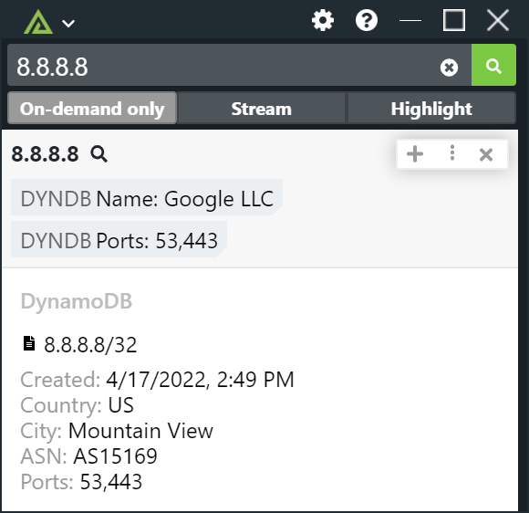

# Polarity AWS DynamoDB Integration

The Polarity DynamoDB integration enables querying of your DynamoDB tables hosted in AWS.



## DynamoDB

### AWS Region

The AWS Region for your DynamoDB database.  The DynamoDB endpoint is based on your selected region.  The integration does not support local developer instances of DynamoDB.

### AWS Access Key Id

The access key ID that identifies the security credentials used to authenticate to the specified DynamoDB instance.  As this integration is designed only for `SELECT` queries we recommend using security credentials tied to an IAM service user with read-only access to Dynamodb. When creating the IAM service user you can assign the `AmazonDynamoDBReadOnlyAccess` AWS managed policy to enforce this.

For more fine-grained control over access to DynamoDB, you can create your own policy and assign the IAM user the `dynamodb:PartiQLSelect` action for the specific DynamoDB table you want to query.

For more information about IAM Security Policies with PartiQL for DynamoDB please see https://docs.aws.amazon.com/amazondynamodb/latest/developerguide/ql-iam.html

### AWS Secret Access Key

The secret access key associated with your Access Key Id that can be used to sign requests.

### PartiQL Query

The PartiQL query to run against your DynamoDB instance.  DynamoDB does not support all PartiQL operations and functions.  Additionally,
if you do not include a partition key field in your `WHERE` clause using the equality `=` operator or the `IN` operator the query will perform a full
table scan which should be avoided.

For more information on how to use PartiQL with DynamoDB please see: https://docs.aws.amazon.com/amazondynamodb/latest/developerguide/ql-reference.html

For specific information on writing `SELECT` queries please see: https://docs.aws.amazon.com/amazondynamodb/latest/developerguide/ql-reference.select.html

### Summary Attributes

Comma delimited list of attribute names to include as part of the summary.  JSON dot notation can be used to target nested attributes. Attributes must be returned by your PartiQL query to be displayed.  You can change the label to your summary attribute by prepending the label to the attribute path and separating it with a colon (i.e., "<label>:<json path>").  For no label, use a colon with no label (i.e., ":<json path>").

See the section on [Specifying Attributes](#specifying-attributes) for more information on how to use this option.

### Maximum Number of Summary Items

Number of items to show summary tags for. Defaults to 3. If the limit is reached, a total item count will be shown.

### Detail Attributes

Comma delimited list of attribute names to include as part of the details block.   JSON dot notation can be used to target nested attributes. Attributes must be returned by your PartiQL query.  You can change the label to your detail attribute by prepending the label to the attribute path and separating it with a colon (i.e., "<label>:<json path>"). If left blank, all fields will be displayed as a JSON document.

See the section on [Specifying Attributes](#specifying-attributes) for more information on how to use this option.

### Item Title Attribute

Name of the attribute to be used as the item title. JSON dot notation can be used to target nested attributes. Attribute must be returned by your PartiQL query to be displayed. You can change the label to your item attribute by prepending the label to the attribute path and separating it with a colon (i.e., "<label>:<json path>"). For no label, use a colon with no label (i.e., ":<json path>").

See the section on [Specifying Attributes](#specifying-attributes) for more information on how to use this option.

## Specifying Attributes

Attributes to display can be specified via the Summary Attributes and Detail Attributes options.  Both options support the same syntax which is a comma delimited list of attribute specifications.  An attribute specification at a minimum is the name of the attribute.  Nested attributes can be targeted using JSON dot notation. In addition, a `type` can be specified for the attribute.  The `type` currently supports various date formats since DynamoDB does not have a native date type.  Specifying `type` will ensure the data from DynamoDB is converted into a human-readable format when displayed in the Overlay Window. 

Attributes can be specified with the following three forms:

```
<attribute>
<label>:<attribute>
<label>:<type>:<attribute>
```

As an example, suppose we have the following item returned by our PartiQL query:

```
{
  "ip": "8.8.8.8",
  "software": {
    "antivirus": "Microsoft Defender"
  },
  "ports": [80, 443],
  "created": 1649724681
}
```

We want our summary tag to display the antivirus software used with the label "AV".  In this example the antivirus attribute is nested under the software attribute.  We can do that with the following:

```
AV:software.av
```

This will display the summary tag `AV: Microsoft Defender`.  If we also want to include the IP Address in the summary tags we can do the following:

```
ip, AV:software.av
```

Which will display the summary tags `8.8.8.8` and `AV: Microsoft Defender`.

If we want to display the `created` attribute and specify that it is a Unix epoch time date in seconds we can do the following:

```
Created:date-seconds:created
```

If you are specifying a `type` for the attribute then you must also specify a `label`.  The integration supports the following date types:

* date-iso
```
2016
2016-05
201605
2016-05-25
20160525
2016-05-25T09
2016-05-25T09:24
2016-05-25T09:24:15
2016-05-25T09:24:15.123
2016-05-25T0924
2016-05-25T092415
2016-05-25T092415.123
2016-05-25T09:24:15,123
2016-W21-3
2016W213
2016-W21-3T09:24:15.123
2016W213T09:24:15.123
2016-200
2016200
2016-200T09:24:15.123
09:24
09:24:15
09:24:15.123
09:24:15,123
```  

* date-http
```
Sunday, 06-Nov-94 08:49:37 GMT
Sun, 06 Nov 1994 08:49:37 GMT
```

* date-rfc2822 
```
Tue, 01 Nov 2016 13:23:12 +0630
```

* date-sql 
```
2017-05-15
2017-05-15 09:24:15
09:24:15
```

* date-seconds 
```
1542674993
```

* date-millis
```
1542674993410
```


## Installation Instructions

Installation instructions for integrations are provided on the [PolarityIO GitHub Page](https://polarityio.github.io/).

## Polarity

Polarity is a memory-augmentation platform that improves and accelerates analyst decision making.  For more information about the Polarity platform please see:

https://polarity.io/
